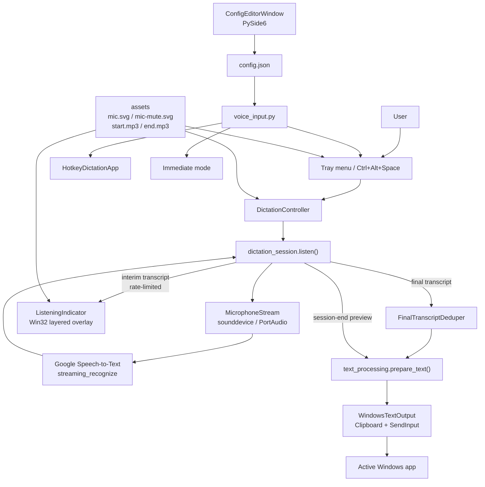
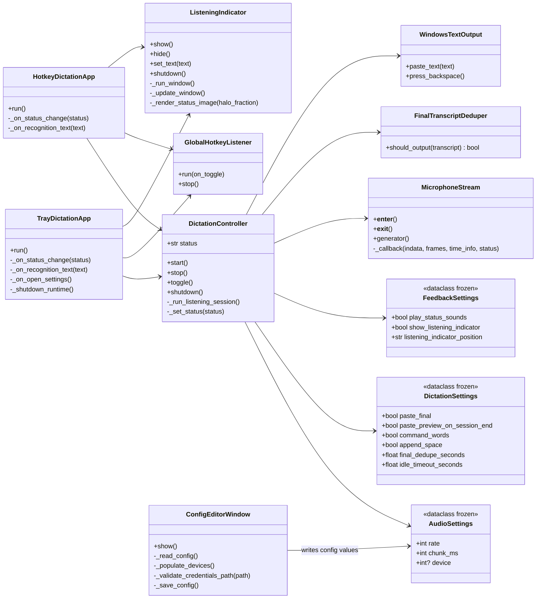
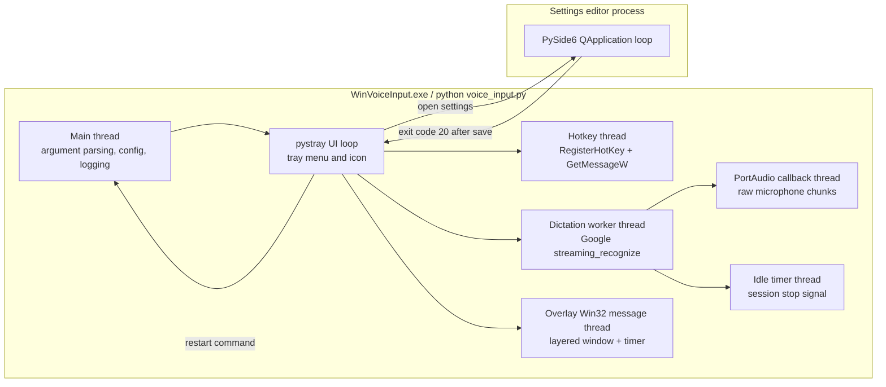
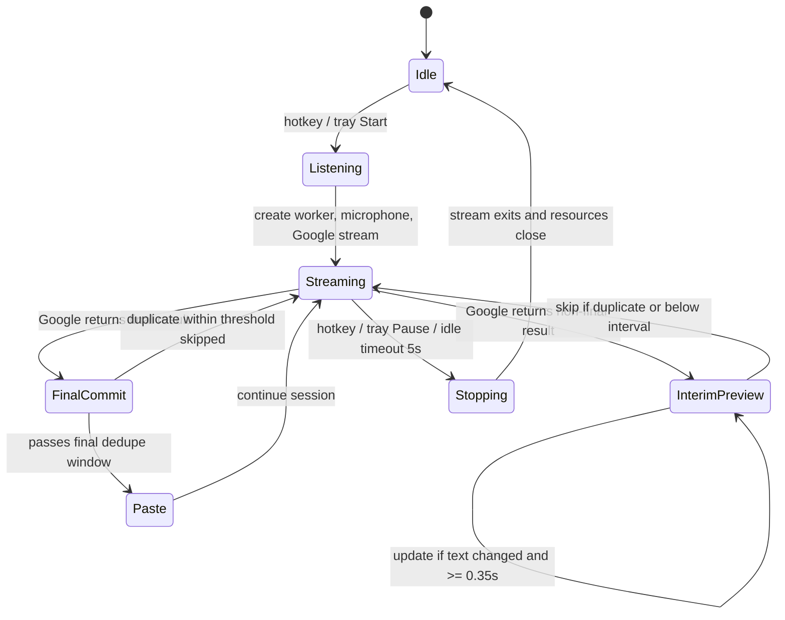
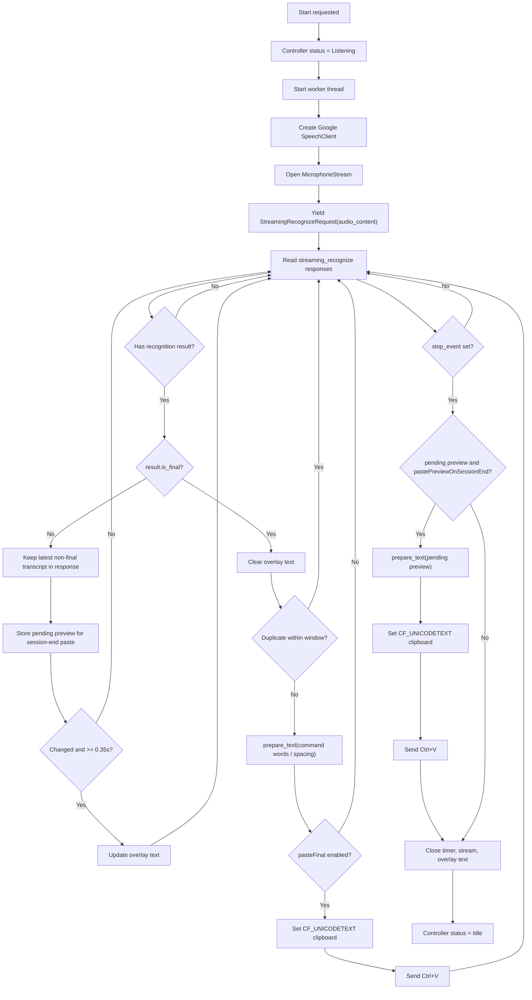
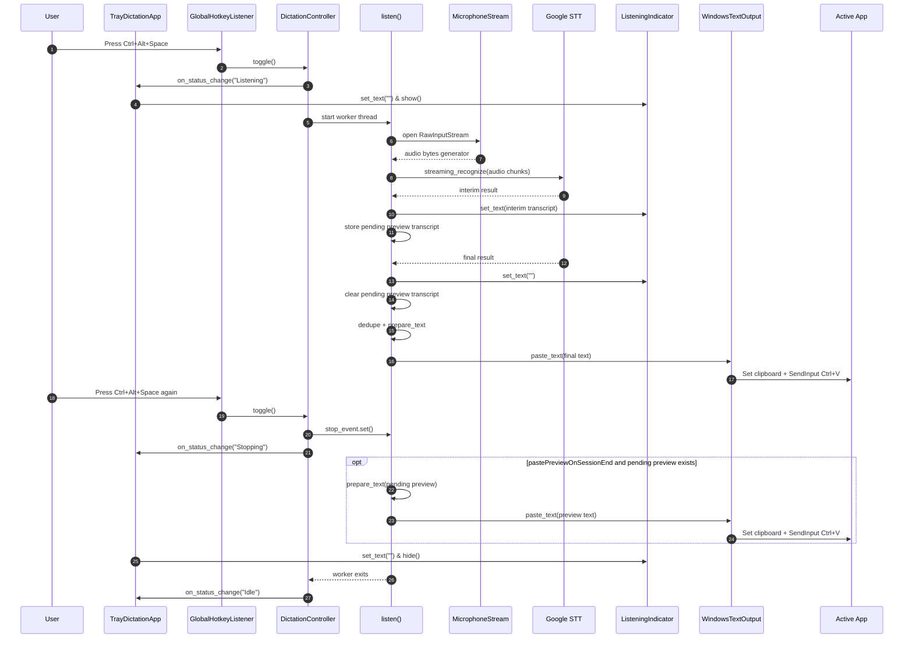

# Win Voice Input 技術文檔

本文檔整理 Win Voice Input 到目前發佈里程碑的技術設計。README 保持面向使用者；本文面向開發、Code Review、維護和後續分發。

## 1. App 目標

Win Voice Input 是一個 Windows 本機語音輸入工具。它透過 Google Speech-to-Text 串流辨識麥克風音訊，將 interim result 顯示在 overlay listening indicator，等 Google 回傳 final result 後才把文字貼到目前前景應用程式。預設也會在 session 結束但 Google 尚未回傳 final 時貼上最後一段 preview；使用者可以關閉 session-end preview 輸出以恢復 strict final-only 行為。這個設計避免把 Google 仍可能修正的中途文字即時寫入輸入框，同時仍然讓使用者知道目前正在辨識甚麼。

核心行為：

- 以 `Ctrl+Alt+Space` 或 tray menu 開始 / 暫停聆聽。
- 使用 Google STT streaming recognition，語言預設為 `yue-Hant-HK`。
- 顯示 tray icon 狀態：聆聽時使用綠色 `mic.svg`，非聆聽時使用主題感知的 `mic-mute.svg`。
- 聆聽時播放 `start.mp3`，停止時播放 `end.mp3`。
- 聆聽時顯示 Win32 layered overlay，overlay 上顯示 interim transcript。
- final transcript 經 Windows clipboard + `SendInput(Ctrl+V)` 貼到目前輸入位置；`pastePreviewOnSessionEnd` 預設開啟，所以 session 結束時仍 pending 的 preview 也會走同一條輸出管線。
- 若指定時間內沒有任何辨識文字，預設 5 秒自動停止該次聆聽 session。
- Settings UI 直接修改 `config.json`，儲存後由主程式重新啟動以載入新設定。

## 2. 架構圖



## 3. UML Class Diagram



## 4. Process / Thread 圖



### Thread 設計原因

- Tray loop 需要保持 responsive，所以 hotkey、Google STT、overlay window 都不可阻塞 tray main loop。
- Google STT streaming 是同步 iterator 形態，因此放在 `DictationController` 的 worker thread。
- `sounddevice.RawInputStream` 由 PortAudio callback 推送 bytes 到 queue，避免在 audio callback 內做網絡或文字處理。
- Overlay 使用 Win32 window message loop，必須在自己的 thread 管理 `CreateWindowExW`、timer、`UpdateLayeredWindow`。
- Settings editor 使用 PySide6 Qt event loop，所以由 tray 開新 process，儲存後用 exit code `20` 通知 parent restart。

## 5. Recognition Progress / Threshold 圖



目前主要 threshold：

| 名稱 | 預設 / 值 | 位置 | 用途 |
| --- | ---: | --- | --- |
| Google audio chunk | `100ms` | `DEFAULT_CHUNK_MS` | 控制送往 Google 的音訊 chunk 大小。 |
| Interim overlay interval | `0.35s` | `INTERIM_OVERLAY_MIN_INTERVAL_SECONDS` | 限制 overlay 更新頻率，避免 Google interim revision 過快導致 UI 跳動。 |
| Idle auto-stop | `5.0s` | `DEFAULT_IDLE_TIMEOUT_SECONDS` | 一段時間沒有任何辨識文字時自動停止 session。 |
| Final dedupe window | `0.8s` | `DEFAULT_FINAL_DEDUPE_SECONDS` | 避免 Google 重複回傳同一 final 造成重複貼上。 |
| Overlay enter / exit animation | `100ms` | `ANIMATION_DURATION_MS` | 聆聽開始 / 結束時淡入滑動、淡出滑動。 |
| Halo pulse loop | `1000ms` | `HALO_PULSE_DURATION_MS` | mic 外圍無漸變光暈循環放大縮小。 |
| Overlay hidden polling | `120ms` | `POLL_INTERVAL_MS` | overlay 隱藏時低頻 timer，降低 idle CPU 使用。 |
| Overlay visible frame interval | `16ms` | `ANIMATION_FRAME_INTERVAL_MS` | overlay 可見時接近 60fps 更新動畫。 |

## 6. Dictation 流程圖



## 7. Sequence Diagram



## 8. App 如何實現結果

### 8.1 啟動與設定

`src/voice_input.py` 是唯一入口。它處理 CLI flags、`config.json`、logging、Google credentials startup check，然後根據設定選擇 tray mode、console hotkey mode 或 immediate mode。

啟動時會先檢查 `GOOGLE_APPLICATION_CREDENTIALS` 或 config 裡面的 `credentials`。如果缺失、不是檔案、或者不可讀，程式會顯示 Windows error message box，並可引導使用者打開 Settings editor。這是硬性啟動檢查，原因是沒有 service account JSON 時第一個 listening session 必定不能建立 Google STT stream。

### 8.2 Tray / Hotkey 控制

Tray mode 使用 `pystray` 顯示 icon、menu、startup notification。`GlobalHotkeyListener` 使用 Win32 `RegisterHotKey` 註冊 `Ctrl+Alt+Space`，並用 `GetMessageW` 等待 `WM_HOTKEY`，收到後呼叫 `DictationController.toggle()`。

Tray icon 狀態由 controller callback 更新：

- `Idle` / `Stopping`：使用 mute icon。
- `Listening`：使用 green mic icon。
- Windows system light/dark theme 由 registry `SystemUsesLightTheme` 決定，用來選擇 muted icon 的對比色。

### 8.3 Audio Capture

`MicrophoneStream` 用 `sounddevice.RawInputStream` 擷取 mono `int16` 音訊。PortAudio callback 只做一件事：把 bytes copy 入 queue。`generator()` 從 queue 讀取 chunk，並合併立即可用的 chunk 後 yield 給 Google client。這樣可把 audio callback 和 Google network call 分離，降低 callback block 住音訊 thread 的風險。

如果 `device` 是 `None`，程式會讀取 Windows default input device；如果指定整數，就使用該 microphone index。

### 8.4 Google Streaming Recognition

`dictation_session.listen()` 建立 `speech.SpeechClient()`，設定：

- `LINEAR16`
- `sample_rate_hertz = audio_settings.rate`
- `language_code = language`
- `enable_automatic_punctuation = True`
- `interim_results = True`
- `single_utterance = False`

Google response 可能在同一 response 內包含多個 result。程式只把該 response 中最後一個 non-final transcript 當作 active interim preview，避免 overlay 在舊 segment 和最新文字之間跳動。

### 8.5 Interim Preview

Interim text 在聆聽期間只會送到 `ListeningIndicator.set_text()`，不會即時貼入 active app。更新有 `0.35s` rate limit，而且必須 text changed。這樣可避免 Google interim result 每秒多次修正時令 overlay 閃動太頻密。因為 `pastePreviewOnSessionEnd` 預設啟用，`listen()` 會另外記住最新 non-final transcript；如果 session 結束前沒有 final result 清空這段 pending preview，才會在 cleanup 階段用同一條 `prepare_text()` / `WindowsTextOutput` 管線貼上。

Overlay 的文字使用 CJK-capable Windows font，如 Microsoft JhengHei / Microsoft YaHei / MingLiU，避免中文變成方框。長文字會做 leading ellipsis，保留最新識別到的尾段文字，因為使用者最需要確認目前正在說的內容。

### 8.6 Final Commit

收到 final transcript 後，程式會：

1. 清空 overlay interim text。
2. 用 `FinalTranscriptDeduper` 檢查短時間內是否重複。
3. 用 `prepare_text()` 處理 command words 和 optional spacing。
4. 如果 `pasteFinal` 啟用，就用 `WindowsTextOutput.paste_text()` 貼到 active app。

`paste_text()` 使用 `CF_UNICODETEXT` 寫入 Windows clipboard，再用 `SendInput` 送出 `Ctrl+V`。這比逐字 key input 更適合中文，亦避免不同輸入法狀態導致字符錯亂。

### 8.7 Overlay Window

`ListeningIndicator` 是 Win32 layered topmost no-activate window，不搶 focus。它用 Pillow 先在高解析度 canvas 畫 panel、mic bubble、SVG mic、文字和 halo，再 downsample 成 32-bit bitmap，交由 `UpdateLayeredWindow` 顯示。

動畫：

- Overlay 在下方時：進入是淡入上推，退出是淡出下推。
- Overlay 在上方時：進入是淡入下推，退出是淡出上推。
- Mic 外圍 halo 用 cosine wave 算出 `0.0 -> 1.0 -> 0.0` 的 pulse fraction，每 1 秒循環。
- Halo frame 以 lazy cache 儲存，每次文字改變會清 cache，避免所有 frame 一次重繪造成 UI 卡頓。

## 9. 檔案與 Class 職責

### 根目錄

| 檔案 | 職責 |
| --- | --- |
| `README.md` | 使用者向說明，本文檔不放入 README。 |
| `config.example.json` | 發佈給使用者參考的設定範例。 |
| `config.json` | 本機實際設定檔；不應視為通用預設。 |
| `build.ps1` | 建立 / 檢查 build dependency，並透過 PyInstaller 產生 `dist/WinVoiceInput`。 |
| `run-dictation.ps1` | Source run 啟動腳本。 |
| `list-devices.ps1` | 列出 sounddevice 可見的 audio devices。 |
| `WinVoiceInput.spec` | PyInstaller 設定，入口為 `src/voice_input.py`，並把 `assets` 打包入 exe distribution。 |
| `requirements.txt` | Runtime dependency。 |
| `requirements-build.txt` | Build-time dependency。 |

### assets

| 檔案 | 職責 |
| --- | --- |
| `assets/mic.svg` | 聆聽狀態 tray icon 和 overlay mic glyph 的來源。 |
| `assets/mic-mute.svg` | 非聆聽狀態 tray icon 的來源。 |
| `assets/start.mp3` | 開始聆聽時的音效。 |
| `assets/end.mp3` | 結束聆聽時的音效。 |

### src root

| 檔案 / Class | 職責 |
| --- | --- |
| `src/voice_input.py` / `main()` | 唯一入口。處理參數、config、logging、credentials startup check、模式選擇、全域錯誤 dialog。 |

### src/audio

| 檔案 / Class | 職責 |
| --- | --- |
| `src/audio/microphone_stream.py` / `MicrophoneStream` | 管理 `sounddevice.RawInputStream`，把 PortAudio callback bytes 轉成 Google streaming iterator。 |
| `src/audio/__init__.py` | Package marker。 |

### src/config

| 檔案 / Class | 職責 |
| --- | --- |
| `src/config/audio_settings.py` / `AudioSettings` | Immutable audio settings：sample rate、chunk size、device index。 |
| `src/config/dictation_settings.py` / `DictationSettings` | Immutable dictation behavior：final paste、session-end preview paste、command words、spacing、dedupe、idle timeout。 |
| `src/config/feedback_settings.py` / `FeedbackSettings` | Immutable feedback settings：status sounds、overlay、overlay position。 |
| `src/config/constants.py` | 預設值、assets folder name、settings save restart exit code、允許 overlay positions。 |
| `src/config/paths.py` / `get_asset_dir()` | 統一 source run 和 PyInstaller run 的 assets path rule。 |
| `src/config/__init__.py` | 對外重新 export config dataclasses、constants、path helper。 |

### src/dictation

| 檔案 / Class | 職責 |
| --- | --- |
| `src/dictation/dictation_controller.py` / `DictationController` | 統一 start / stop / toggle / shutdown lifecycle；播放 status sound；在 worker thread 執行 listening session；回報 UI status。 |
| `src/dictation/dictation_session.py` / `listen()` | Google STT streaming 主流程；處理 interim/final、idle timer、console preview、overlay text callback、final paste。 |
| `src/dictation/final_transcript_deduper.py` / `FinalTranscriptDeduper` | 時間窗內避免同一 final transcript 重複輸出。 |
| `src/dictation/text_processing.py` / `prepare_text()`、`add_spacing()` | 處理 command words、backspace command、punctuation replacement、optional final spacing。 |
| `src/dictation/__init__.py` | Package marker。 |

### src/output

| 檔案 / Class | 職責 |
| --- | --- |
| `src/output/windows_text_output.py` / `WindowsTextOutput` | 唯一 Windows output side-effect 邊界；寫入 `CF_UNICODETEXT` clipboard，並用 `SendInput` 貼上或送 backspace。 |
| `src/output/__init__.py` | Package marker。 |

### src/ui

| 檔案 / Class | 職責 |
| --- | --- |
| `src/ui/tray_dictation_app.py` / `TrayDictationApp` | Tray shell。管理 pystray icon/menu、hotkey thread、overlay、settings child process、restart、logs/config folder action。 |
| `src/ui/hotkey_dictation_app.py` / `HotkeyDictationApp` | Console hotkey shell。用同一 controller + hotkey listener，無 tray。 |
| `src/ui/global_hotkey_listener.py` / `GlobalHotkeyListener` | Win32 global hotkey registration 和 message loop；只負責把 `Ctrl+Alt+Space` 轉成 callback。 |
| `src/ui/listening_indicator.py` / `ListeningIndicator` | Win32 layered overlay。負責顯示聆聽狀態、interim text、enter/exit animation、halo pulse、CJK font rendering。 |
| `src/ui/config_editor_window.py` / `ConfigEditorWindow` | PySide6 Settings UI。讀寫 `config.json`、列 microphone、驗證 Google credentials、設定 HKCU Run startup。 |
| `src/ui/error_dialog.py` / `show_error_message()` | Win32 message box wrapper，用於 windowed build 的啟動 / runtime 錯誤提示。 |
| `src/ui/__init__.py` | Package marker。 |

### src/win32_types

這個 package 將 ctypes Win32 structure 拆成一檔一 class，原因是 review 時可以逐一確認 memory layout，亦避免不同 module 定義不同 `MSG` class 導致 `ctypes.argtypes` 不相容。

| 檔案 / Class | 職責 |
| --- | --- |
| `src/win32_types/aliases.py` | 定義 `LRESULT`、`UINT_PTR`、`ULONG_PTR` 等 pointer-size aware aliases。 |
| `src/win32_types/bitmap_info.py` / `BITMAPINFO` | `CreateDIBSection` 所需 bitmap info container。 |
| `src/win32_types/bitmap_info_header.py` / `BITMAPINFOHEADER` | 描述 32-bit top-down BGRA bitmap header。 |
| `src/win32_types/blend_function.py` / `BLENDFUNCTION` | `UpdateLayeredWindow` alpha blend 設定。 |
| `src/win32_types/hardware_input.py` / `HARDWAREINPUT` | `INPUT_UNION` 的 hardware branch，用於匹配 Win32 `INPUT` layout。 |
| `src/win32_types/input.py` / `INPUT` | `SendInput` 需要的 top-level input structure。 |
| `src/win32_types/input_union.py` / `INPUT_UNION` | 包含 mouse / keyboard / hardware input branch。 |
| `src/win32_types/keybd_input.py` / `KEYBDINPUT` | 鍵盤事件 layout，用於 Ctrl+V 和 Backspace。 |
| `src/win32_types/mouse_input.py` / `MOUSEINPUT` | 主要為保持 `INPUT_UNION` 正確大小，避免 `SendInput` WinError 87。 |
| `src/win32_types/msg.py` / `MSG` | `GetMessageW` 共用 message structure，hotkey 和 overlay 都依賴它。 |
| `src/win32_types/point.py` / `POINT` | Win32 coordinate structure。 |
| `src/win32_types/rect.py` / `RECT` | Desktop work area rectangle，用於 overlay 定位。 |
| `src/win32_types/rgb_quad.py` / `RGBQUAD` | `BITMAPINFO` color table element。 |
| `src/win32_types/size.py` / `SIZE` | `UpdateLayeredWindow` bitmap size。 |
| `src/win32_types/window_procedure.py` / `WindowProcedure` | `WNDPROC` callback type。 |
| `src/win32_types/wndclassexw.py` / `WNDCLASSEXW` | `RegisterClassExW` window class structure。 |
| `src/win32_types/__init__.py` | 對外重新 export 所有 Win32 ctypes types。 |

## 10. 發佈與打包

PyInstaller 使用 `WinVoiceInput.spec`：

- 入口：`src/voice_input.py`
- windowed exe：`console=False`
- bundled data：`assets -> assets`
- hidden imports：`pystray._win32`、`google.cloud.speech_v1`、`google.api_core`

打包後 assets 由 `sys._MEIPASS/assets` 讀取；source run 則由 project root 的 `assets` 讀取。這個規則集中在 `config.paths.get_asset_dir()`，避免 tray icon、overlay mic icon、status sounds 使用不同 path。

## 11. Error Handling 原則

- 啟動階段錯誤會用 message box 顯示，因為 windowed build 沒有 console。
- Google credentials 問題在啟動時檢查，不等到第一次聆聽才失敗。
- 非關鍵提示如 startup notification 失敗只 log warning，不阻止 app 繼續運作。
- Paste warning 不會終止 Google stream，因為 clipboard lock 可能是短暫現象，下一個 final result 仍有機會成功。
- 不使用會改變業務邏輯的隱性 fallback；必要情況應先由使用者確認。

## 12. 已知設計取捨

- Overlay 不跟隨文字游標，因為瀏覽器 / Electron / 自繪 editor 不一定暴露可靠 caret position。
- Interim transcript 不寫入輸入框，因為 Google interim result 會反覆修正，寫入輸入框會造成重複、刪除和 IME 兼容問題。
- Final output 使用 clipboard + Ctrl+V，而不是逐字 key input，因為中文 Unicode 文字在不同輸入法狀態下逐字送鍵較不穩定。
- Settings editor 儲存後重新啟動主程式，避免 runtime object 在半途中熱更新設定而造成 tray、hotkey、overlay、Google stream 狀態不一致。

## 13. 開發者 Setup / Run / Build

本節保留開發者工作流程。README 只面向普通使用者和已編譯 exe 的使用方式。

### 13.1 Runtime Setup

1. 安裝 Python 3.11 或更新版本。
2. 建立或選擇 Google Cloud project。
3. 啟用 Cloud Speech-to-Text API。
4. 建立 service account key JSON 檔案。
5. 在 PowerShell 指定 Google auth：

```powershell
$env:GOOGLE_APPLICATION_CREDENTIALS="D:\path\to\service-account.json"
```

6. 安裝 runtime dependencies：

```powershell
pip install -r requirements.txt
```

### 13.2 Project Layout

- `src\voice_input.py`：Python entry point，source run 和 PyInstaller 都使用它。
- `src\audio\`、`src\config\`、`src\dictation\`、`src\output\`、`src\ui\`、`src\win32_types\`：按職責拆分的 source packages。
- `assets\`：必要資源，包括 `mic.svg`、`mic-mute.svg`、`start.mp3`、`end.mp3`。
- `run-dictation.ps1`、`list-devices.ps1`、`build.ps1`：根目錄 PowerShell scripts。
- `config.example.json`：本機設定範本。
- `requirements.txt`：runtime dependency list。
- `requirements-build.txt`：build-only dependency list。

### 13.3 Source Run

日常 source run：

```powershell
powershell -ExecutionPolicy Bypass -File .\run-dictation.ps1
```

指定 credentials：

```powershell
powershell -ExecutionPolicy Bypass -File .\run-dictation.ps1 -Credentials "D:\path\to\service-account.json"
```

列出 microphones：

```powershell
powershell -ExecutionPolicy Bypass -File .\list-devices.ps1
```

指定 microphone：

```powershell
powershell -ExecutionPolicy Bypass -File .\run-dictation.ps1 -Credentials "D:\path\to\service-account.json" -Device 1
```

指定語言：

```powershell
powershell -ExecutionPolicy Bypass -File .\run-dictation.ps1 -Credentials "D:\path\to\service-account.json" -Language en-US
```

Console-safe / no-output mode：

```powershell
powershell -ExecutionPolicy Bypass -File .\run-dictation.ps1 -Credentials "D:\path\to\service-account.json" -NoPasteFinal -NoPastePreviewOnSessionEnd
```

`-NoPasteFinal` only disables normal final transcript paste. Because
`pastePreviewOnSessionEnd` defaults on to salvage short utterances, use
`-NoPastePreviewOnSessionEnd` as well when the run must not write any recognized
text into the active app.

不使用 tray：

```powershell
powershell -ExecutionPolicy Bypass -File .\run-dictation.ps1 -Credentials "D:\path\to\service-account.json" -NoTray
```

不使用 tray 或 global hotkey，啟動後立即聆聽：

```powershell
powershell -ExecutionPolicy Bypass -File .\run-dictation.ps1 -Credentials "D:\path\to\service-account.json" -NoTray -NoHotkey
```

修改 idle timeout：

```powershell
powershell -ExecutionPolicy Bypass -File .\run-dictation.ps1 -Credentials "D:\path\to\service-account.json" -IdleTimeoutSeconds 8
```

啟用 command words 測試：

```powershell
powershell -ExecutionPolicy Bypass -File .\run-dictation.ps1 -Credentials "D:\path\to\service-account.json" -CommandWords
```

### 13.4 Build Windows Exe

安裝 build-only dependency：

```powershell
.\.venv\Scripts\python.exe -m pip install -r requirements-build.txt
```

建立測試 package：

```powershell
powershell -ExecutionPolicy Bypass -File .\build.ps1
```

輸出位置：

```text
dist\WinVoiceInput\WinVoiceInput.exe
```

預設 build 會保留 console window，方便測試 startup error、microphone 選擇和 Google authentication 訊息。穩定後可建立 windowed build：

```powershell
powershell -ExecutionPolicy Bypass -File .\build.ps1 -Windowed
```

Packaged exe 會從 `WinVoiceInput.exe` 同一 folder 讀取 `config.json`，所以正式分發時需要把 `config.json` 放在 `dist\WinVoiceInput` 內或由首次啟動 Settings 建立。
